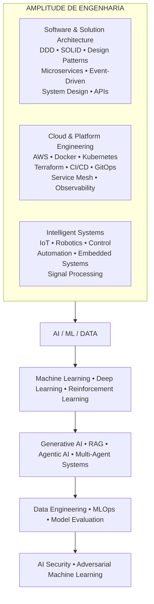
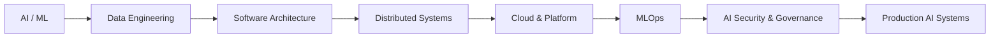

# Yuri Fernando Dubbern

### AI/ML & Data Engineer · Software & Solution Architecture · Applied AI Research

Pesquisador e doutorando em Ciência da Computação | AI Systems · Machine Learning · Data · Architecture · Automation

 

  

Artificial Intelligence • Machine Learning • Data Engineering • Software Architecture • Distributed Systems • Cloud • MLOps • Intelligent Automation

---

## Sobre

Sou Mestre em Engenharia Elétrica e doutorando em Ciência da Computação pela UFSCar, com atuação em pesquisa aplicada e desenvolvimento de sistemas na interseção entre Inteligência Artificial, Machine Learning, Engenharia de Dados, Arquitetura de Software e Automação Inteligente.

Minha principal profundidade técnica está em AI/ML e Data. A partir desse núcleo, meus projetos avançam por backend engineering, sistemas distribuídos, cloud, DevOps, MLOps, IoT, robótica, controle e automação.

O trabalho vai de modelos de Machine Learning, RAG e sistemas multiagente a APIs, microsserviços, arquiteturas orientadas a eventos, plataformas de dados, infraestrutura cloud-native, observabilidade e governança de IA.

### Direção de engenharia

Dados → Inteligência → Decisão → Execução

Meu objetivo é ir além do modelo isolado e trabalhar o sistema completo em que ele opera: arquitetura, integração, escala, observabilidade, segurança, governança e operação.

---

## Atualmente

🔬 Pesquisa aplicada em Inteligência Artificial, Machine Learning, sistemas inteligentes, automação e aplicações orientadas a dados.

🛠️ Desenvolvimento de projetos autorais em AI/ML, Data Engineering, Agentic AI, RAG, SaaS, arquitetura de software, cloud e automação.

🚀 Evolução de projetos de portfólio para arquiteturas mais completas, com System Design, DDD, microsserviços, mensageria, Kubernetes, MLOps, observabilidade e AI Security.

🎯 Foco profissional em AI/ML Engineering, Data Engineering, AI Engineering, Machine Learning, Software/Solution Architecture e Intelligent Automation.

---

## Engineering Profile — T-Shaped

Minha profundidade principal está em AI/ML e Data Engineering. A amplitude vem de arquitetura de software, sistemas distribuídos, cloud/platform engineering e sistemas inteligentes.

### Visão em Markdown

| Software & Solution Architecture | AI / ML / Data — Profundidade | Cloud, Platform & Systems |
|:---|:---:|---:|
| DDD • SOLID • Design Patterns | Machine Learning • Deep Learning | AWS • Docker • Kubernetes |
| Clean / Hexagonal Architecture | Reinforcement Learning • GenAI | Terraform • IaC • CI/CD |
| Microservices • Event-Driven | RAG • Agentic AI • MLOps | GitOps • Service Mesh |
| Kafka • RabbitMQ • APIs | Data Engineering • Model Evaluation | Observability • Reliability |
| System Design • ADRs • RFCs | AI Security • Adversarial ML | IoT • Robotics • Automation |

### Diagrama T-Shaped

Esse perfil T-shaped me permite aprofundar modelos, pipelines e sistemas de IA sem perder de vista o ambiente completo no qual eles operam.

---

## Projetos em Destaque

### 👁️ [Argus — Enterprise AI & Data Platform](https://github.com/Yuri-Fernando/Argus)

Plataforma full-stack de Dados & IA para Customer Intelligence e principal projeto de arquitetura do portfólio.

Integra Data Engineering, Lakehouse, Data Warehouse, MDM/Golden Record, Machine Learning, RAG, sistemas multiagente, governança e infraestrutura cloud. A evolução arquitetural incorpora DDD, microsserviços, arquitetura orientada a eventos, Kafka/RabbitMQ, Java/Python, APIs distribuídas, Kubernetes, Service Mesh, Data Mesh, MLOps e AI Security.

Python • Databricks • Snowflake • Spark • dbt • MLflow • LangGraph • Agno • MCP • RAG • AWS • Kubernetes • Terraform

🔗 [Repositório](https://github.com/Yuri-Fernando/Argus)

---

### ⚖️ [ThemisAI — AI Governance & Security](https://github.com/Yuri-Fernando/ThemisAI)

Plataforma de governança, privacidade e avaliação de sistemas de IA sob a LGPD, com PII detection, políticas declarativas, geração de RIPD, fairness audit, red-teaming, differential privacy e verificação formal.

A evolução adiciona uma camada de Adversarial Machine Learning para avaliação de ataques, comportamento sob perturbações, riscos de modelos e estratégias defensivas.

Python • FastAPI • Streamlit • Machine Learning • AI Governance • Privacy • Compliance • Red Teaming • Adversarial ML

🔗 [Repositório](https://github.com/Yuri-Fernando/ThemisAI)

---

### 📈 [RetentIQ — Customer Intelligence SaaS](https://github.com/Yuri-Fernando/RetentIQ)

Plataforma full-stack de inteligência de receita e retenção para e-commerce, integrando ETL, Data Warehouse, Machine Learning para churn/forecast/recomendação, API REST/GraphQL e dashboard Next.js.

A evolução arquitetural explora Event-Driven Architecture, processamento assíncrono, mensageria, serviços distribuídos e observabilidade.

Python • TypeScript • Next.js • Node.js • GraphQL • Machine Learning • Data Engineering • Distributed Systems

🔗 [Repositório](https://github.com/Yuri-Fernando/RetentIQ)

---

### 🏗️ [Enterprise-Automation — Cloud Platform Engineering](https://github.com/Yuri-Fernando/Enterprise-Automation)

Plataforma de automação de infraestrutura AWS com abordagem Terraform-first, gerenciamento de configuração via Ansible/PowerShell, controller Python, CI/CD, segurança, observabilidade e mecanismos de self-healing.

O projeto reproduz o ciclo de uma plataforma enterprise: provisionar → configurar → monitorar → detectar → diagnosticar → remediar → validar → registrar.

AWS • Terraform • Ansible • PowerShell • Python • GitHub Actions • CI/CD • Observability • Self-Healing

🔗 [Repositório](https://github.com/Yuri-Fernando/Enterprise-Automation)

---

### 🛡️ [AegisLLM — LLM Security & Red Teaming](https://github.com/Yuri-Fernando/AegisLLM)

Projeto orientado à segurança de aplicações baseadas em LLMs, explorando RAG security, roteamento multi-modelo, red teaming, avaliação adversarial e observabilidade.

LLM Security • LLMOps • RAG Security • Red Teaming • AI Governance • Observability

🔗 [Repositório](https://github.com/Yuri-Fernando/AegisLLM)

---

### 📜 [TRINITY — Temporal Regulatory Intelligence Network](https://github.com/Yuri-Fernando/TRINITY)

Pipeline de IA para monitoramento e quantificação de incerteza regulatória, integrando ingestão documental, processamento semântico, embeddings, classificação com LLMs, índices temporais e dashboard.

Python • NLP • Embeddings • LLMs • Streamlit • Regulatory Tech • Time-Series Intelligence

🔗 [Repositório](https://github.com/Yuri-Fernando/TRINITY)

---

## Outros Projetos Relevantes

| Projeto | Área | Foco técnico |
|---|---|---|
| [Self-Evolving RL-PID AGV](https://github.com/Yuri-Fernando/Self_Evolving_RL_PID-AGV) | Robotics / RL | Reinforcement Learning • PID • Adaptive Control • AGV • Adversarial RL |
| [OmniMind AI OS](https://github.com/Yuri-Fernando/OmniMind_AI_OS) | Agentic AI | Planning • RAG • Memory • Multi-Agent Systems • AI Infrastructure |
| [Churn Intelligence](https://github.com/Yuri-Fernando/Churn_intelligence) | ML / Data | Churn • RAG • FastAPI • MLflow • Streaming • Model Evaluation |
| [VisionGuard](https://github.com/Yuri-Fernando/OOP_Project) | Computer Vision | YOLOv8 • OpenCV • ResNet • Event-Driven Vision • Adversarial CV |
| [AI Network Optimizer](https://github.com/Yuri-Fernando/AI-Network-Optimizer) | Telecom / ML | O-RAN • xApp • Machine Learning • gRPC • Kubernetes |
| [AuditFlow](https://github.com/Yuri-Fernando/Projeto-RPA-Contabil_Inteligente) | Automation / BI | RPA • ETL • ML • Explainable AI • BI |
| [RiskCredit](https://github.com/Yuri-Fernando/RiskCredit) | Credit Risk / ML | Classification • Explainability • Risk Modeling |
| [Credit Score Predictor](https://github.com/Yuri-Fernando/Credit-Score-Predictor---AWS-Streamlit) | ML + Cloud | AWS • Lambda • SageMaker • API Gateway • DynamoDB |
| [Product Recommendation NLP + Graph](https://github.com/Yuri-Fernando/Recomendacao-de-produtos-NLP_Grafo) | Recommendation Systems | DistilBERT • Graphs • PyTorch • NLP |
| [Voice Anti-Spoofing](https://github.com/Yuri-Fernando/Voice-Anti-Spoofing) | AI Security | DSP • Deep Learning • Voice Biometrics • PAD • Audio Deepfake Detection |
| [AuraSense](https://github.com/Yuri-Fernando/AuraSense) | AI + Signal Processing | DSP • Machine Learning • Sensor Data • Intelligent Systems |
| [QAOA Portfolio](https://github.com/Yuri-Fernando/Projeto-Quantico-QAOA) | Quantum Computing | Qiskit • QAOA • QUBO • Portfolio Optimization |
| [CyberLab](https://github.com/Yuri-Fernando/CyberLab) | Cybersecurity | Linux • Nmap • Hardening • Security Automation |
| [Agente-RAG](https://github.com/Yuri-Fernando/Agente-RAG) | RAG / Automation | n8n • RAG • Google Drive • Telegram • Semantic Search |
| [AgenteMCP](https://github.com/Yuri-Fernando/AgenteMCP) | Agentic AI | MCP • n8n • LLMs • Dynamic Tool Selection |
| [Multi-Agent Customer Insights](https://github.com/Yuri-Fernando/Multi-Agent-Customer-Insights-OpenAI-Version) | Multi-Agent AI | Research • Analysis • Strategy • Orchestration |
| [Agente Calendar + HubSpot](https://github.com/Yuri-Fernando/Agente-Calendar-com-Hubspot) | Business Automation | HubSpot • Google Calendar • Supabase • WhatsApp • n8n |
| [Agente Conversacional](https://github.com/Yuri-Fernando/Agente-Conversacional) | Conversational AI | WhatsApp • GPT • Supabase • Memory • n8n |
| [n8n](https://github.com/Yuri-Fernando/n8n) | Intelligent Automation | Agentic AI • SaaS • CRM • Marketing • Workflow Automation |
| [Engenharia Elétrica](https://github.com/Yuri-Fernando/Engenharia_Eletrica) | Engineering R&D | IoT • Embedded Systems • Power Quality • Signal Processing |
| [Analisador de DHT](https://github.com/Yuri-Fernando/Analisador-de-DHT) | Power Quality / IoT | ESP32 • Harmonics • THD/DHT • DSP |
| [TCC — Smart Home Embedded](https://github.com/Yuri-Fernando/TCC) | Embedded / IoT | ARM TM4C1294 • Webserver • ThingSpeak • Automation |
| [IoT ESP32-CAM](https://github.com/Yuri-Fernando/Iot_esp32cam) | IoT / Computer Vision | ESP32-CAM • PIR • Streaming • Home Security |
| [Chatbot3IA](https://github.com/Yuri-Fernando/Chatbot3IA) | Conversational AI | Flask • Local ML • AI APIs • Chatbots |
| [Heart Rate via Webcam](https://github.com/Yuri-Fernando/Monitor-de-frequencia-Cardiaca-por-WEB-CAM.) | Computer Vision / DSP | rPPG • OpenCV • Digital Filtering • Spectral Analysis |
| [Transfer Android](https://github.com/Yuri-Fernando/Transfer_Android) | Automation | Python • ADB • File Transfer • Automation |
| [YTDL4EDU](https://github.com/Yuri-Fernando/YTDL4EDU) | Automation / Education | Python • yt-dlp • Media Processing |
| [IA Agentica](https://github.com/Yuri-Fernando/IA_Agentica) | Agentic AI Infrastructure | Agents • Skills • MCP Servers • Git Submodules |
| [Projetos Pessoais](https://github.com/Yuri-Fernando/Projetos_Pessoais) | Portfolio Hub | AI • Data • Automation • Research |
| [GrokBot](https://github.com/Yuri-Fernando/GrokBot) | AI Systems | Agent / AI experimentation |
| [Profile README](https://github.com/Yuri-Fernando/Yuri-Fernando) | Portfolio | GitHub profile and technical positioning |

<b>🔗 Ver todos os repositórios públicos no GitHub</b>

 

A lista pública completa e atualizada está disponível em:

https://github.com/Yuri-Fernando?tab=repositories

---

# Tech Stack

## 🧠 Artificial Intelligence & GenAI

LangChain • LangGraph • Agno • CrewAI • OpenAI API • Claude API • RAGAS • DeepEval • Langfuse • MCP • A2A • Tool Calling • Embeddings • Vector Search

---

## 🤖 Machine Learning & Data Science

Machine Learning • Deep Learning • Reinforcement Learning • NLP • Computer Vision • Feature Engineering • Model Evaluation • Explainable AI • Predictive Modeling • Anomaly Detection • Adversarial Machine Learning

---

## 📊 Data Engineering & Analytics

ETL / ELT • Data Pipelines • Data Modeling • Data Warehouse • Data Lake • Lakehouse • Data Mesh • Data Products • Medallion Architecture • Spark • Databricks • Snowflake • Delta Lake • Streaming • Data Quality • Lineage • BI

---

## ☁️ Cloud, MLOps & Infrastructure

AWS • Azure • Terraform • Infrastructure as Code • Docker • Kubernetes • Helm • Service Mesh • CI/CD • GitOps • MLflow • Model Registry • Model Serving • Drift Detection • Observability

---

## ⚙️ Software Engineering & APIs

Python • Java • TypeScript • SQL • C/C++ • FastAPI • Spring Boot • REST • GraphQL • gRPC • Microservices • DDD • SOLID • Clean Architecture • Hexagonal Architecture • Design Patterns • Kafka • RabbitMQ • Event-Driven Architecture • System Design

---

## 🔄 Automation & Intelligent Workflows

n8n • RPA • Workflow Orchestration • CRM Integration • WhatsApp Automation • API Integration • Business Process Automation • Agentic Workflows • Event-Driven Automation

---

## 🔬 Applied Research & Advanced Computing

Artificial Intelligence • Machine Learning • Reinforcement Learning • Distributed AI • Multi-Agent Systems • Robotics • Adaptive Control • Digital Signal Processing • Computer Vision • IoT • Embedded Systems • Optimization • Mathematical Modeling • Statistical Modeling • Monte Carlo Simulation • Quantum Computing • QAOA / QUBO

---

## 📚 Formação & Pesquisa

🎓 Doutorado em Ciência da Computação — UFSCar — em andamento

Pesquisa aplicada em sistemas inteligentes, Inteligência Artificial, Machine Learning, automação, robótica e aplicações orientadas a dados.

🎓 Mestrado em Engenharia Elétrica — UFSCar

Pesquisa envolvendo modelagem matemática, sistemas de engenharia, processamento de sinais, qualidade de energia, IoT e sistemas embarcados.

📚 Formação complementar

Data Science • Data Analytics • Software Engineering • Internet of Things • Industry 4.0

---

## Arquitetura & System Design

Domain-Driven Design • SOLID • Clean Architecture • Hexagonal Architecture • Design Patterns • Microservices • Event-Driven Architecture • Kafka • RabbitMQ • REST • GraphQL • gRPC • Docker • Kubernetes • Service Mesh • Infrastructure as Code • GitOps

System Design • Functional / Non-Functional Requirements • Capacity Estimation • High Availability • Scalability • Consistency • Resilience • Caching • Security • Observability • Disaster Recovery • Architectural Trade-offs

ADRs • RFCs • C4 Diagrams • API Contracts • Domain Models • Runbooks • Architecture Documentation • Engineering Standards

---

## AI Security & Adversarial Machine Learning

Linha transversal de pesquisa e desenvolvimento aplicada a diferentes tipos de modelos e sistemas inteligentes.

Adversarial Examples • Evasion Attacks • Data Poisoning • Model Extraction • Model Inversion • Adversarial Training • Red Teaming • LLM Security • RAG Security • Model Evaluation

| Projeto | Aplicação |
|---|---|
| [ThemisAI](https://github.com/Yuri-Fernando/ThemisAI) | Governance gates • Model security • Adversarial evaluation |
| [VisionGuard](https://github.com/Yuri-Fernando/OOP_Project) | FGSM • PGD • Adversarial patches • Computer Vision |
| [RiskCredit](https://github.com/Yuri-Fernando/RiskCredit) | Feature manipulation • Evasion • Tabular ML |
| [Self-Evolving RL-PID AGV](https://github.com/Yuri-Fernando/Self_Evolving_RL_PID-AGV) | Sensor perturbation • State attacks • Adversarial RL |
| [AegisLLM](https://github.com/Yuri-Fernando/AegisLLM) | Prompt injection • Jailbreaks • RAG security • LLM red teaming |

---

## Atualmente construindo

Estou consolidando os projetos em torno de uma pergunta de engenharia:

> Como transformar um modelo de IA que funciona isoladamente em um sistema inteligente escalável, observável, resiliente, seguro, governado e pronto para produção?

---

## Princípios de Engenharia

> IA sem arquitetura vira demo.  
> Dados sem contexto viram ruído.  
> Modelo sem avaliação vira hipótese.  
> Sistema distribuído sem observabilidade vira investigação paranormal.  
> Automação sem integração vira tarefa isolada.

Meu foco é construir sistemas nos quais IA não seja apenas uma interface de conversa ou uma feature isolada, mas parte real da arquitetura do produto.

---

## Contato

  

### AI · Data · Architecture · Automation · Intelligent Systems

Building models. Engineering the systems around them.

